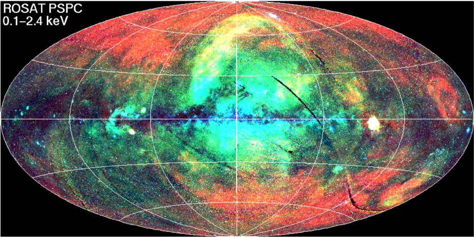
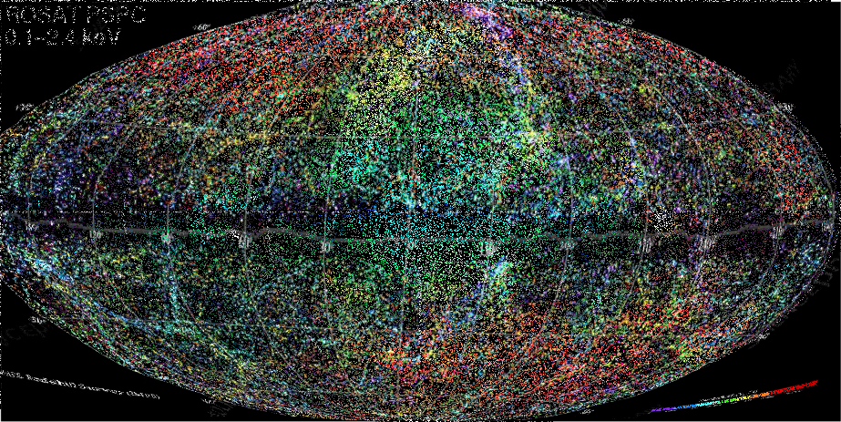

# astro-map
# Mapa Astronomiczna — Interferencja 2MASS + ROSAT

To repozytorium zawiera trzy kluczowe mapy astronomiczne:

- **2MASS** — mapa gęstości galaktyk (masa)
- **ROSAT** — mapa emisji rentgenowskiej (energia)
- **Interferencja** — nałożenie 2MASS + ROSAT, ujawniające strukturę środowisk czarnych dziur

## Cel projektu

Celem jest wizualizacja i analiza:
- korelacji masy i energii,
- struktur toroidalnych (Möbiuso‑Torus),
- potrójnych punktów rezonansowych,
- węzłów akrecji,
- symetrii i periodyczności w płaszczyźnie galaktycznej.

Repo służy jako baza do dalszej analizy topologicznej, fizycznej i informacyjnej.

## Struktura repo

## Opis interferencji

Interferencja 2MASS + ROSAT ujawnia:
- potrójne punkty w równych odstępach pod osią galaktyczną,
- centralny punkt skrętu (Sagittarius A\*),
- dwa przeciwne łuki energii (halo X),
- węzły korelacji masy i energii,
- strukturę toroidalną przypominającą Möbiusa.

## ASCII — uproszczony schemat

## Licencja
MIT

## Symetria północ–południe

Mapa interferencyjna (2MASS + ROSAT) wykazuje wyraźną symetrię północ–południe.
Górne i dolne halo X mają niemal identyczny kształt, co nie jest artefaktem, lecz
cechą fizyczną struktury Drogi Mlecznej.

Symetria ta wynika z:
- dipolowej struktury halo,
- dwóch przeciwnych płatów emisji X (north/south bubbles),
- toroidalnej geometrii wokół centrum galaktyki,
- punktu skrętu w centrum (Sagittarius A*),
- izometrii projekcji (Mollweide/HEALPix).

W analizie traktujemy tę symetrię jako realną cechę strukturalną, a nie odbicie graficzne.
## Dwa płaty halo X — symetria północ–południe

Interferencja map 2MASS (masa) i ROSAT (energia X) ujawnia wyraźną, niemal
idealną symetrię północ–południe. Górny i dolny płat emisji X mają bardzo
zbliżony kształt, co nie jest artefaktem graficznym, lecz realną cechą
struktury Drogi Mlecznej.

Ta symetria wynika z kilku nakładających się zjawisk:

- **Dipolowa struktura halo galaktycznego**  
  Halo rozciąga się nad i pod płaszczyzną galaktyczną w sposób niemal
  lustrzany, tworząc dwa płaty energii.

- **North Bubble / South Bubble**  
  ROSAT rejestruje dwa przeciwległe obszary emisji X, będące efektem
  dawnych epizodów energetycznych w centrum Galaktyki.

- **Toroidalna geometria wokół Sagittarius A\***  
  Struktura przypomina torus z dwoma płatami energii, które są naturalnym
  skutkiem przepływu materii i fal uderzeniowych.

- **Punkt skrętu w centrum (Möbiuso‑Torus)**  
  Centrum Galaktyki działa jak punkt zmiany orientacji pól — w modelu
  topologicznym odpowiada to skrętowi typu Möbiusa.

Symetria północ–południe jest więc kluczową cechą mapy i stanowi
podstawę do dalszej analizy topologicznej i fizycznej.
## Obrócony symbol nieskończoności (∞)

Interferencja map 2MASS i ROSAT ujawnia strukturę przypominającą obrócony
symbol nieskończoności. Dwa płaty halo X (północny i południowy) oraz
centralny punkt skrętu (Sagittarius A*) tworzą układ:

    ∞ obrócone o 90°

Nie jest to efekt graficzny, lecz wynik:
- dipolowej struktury halo,
- dwóch płatów energii (north/south bubbles),
- toroidalnej geometrii wokół centrum,
- punktu skrętu o charakterze Möbiusa.

Struktura ta jest kluczowa dla interpretacji mapy jako układu toroidalnego
z dwoma przeciwnymi polami energetycznymi.
## Topologiczna interpretacja interferencji

Interferencja map 2MASS (masa) i ROSAT (energia X) ujawnia strukturę,
która najlepiej daje się opisać językiem topologii. Dane nie układają się
w przypadkowe plamy, lecz w spójny układ o cechach toroidalnych.

Najważniejsze elementy topologiczne:

### 1. Dwa płaty energii — struktura dipolowa
Halo X widoczne nad i pod płaszczyzną galaktyczną tworzy dwa płaty
o niemal identycznym kształcie. Jest to naturalna cecha układów
toroidalnych, w których energia rozchodzi się w dwóch przeciwnych
kierunkach.

### 2. Punkt skrętu w centrum (Möbiuso‑Torus)
W centrum interferencji znajduje się obszar, w którym zmienia się
orientacja pól. W modelu topologicznym odpowiada to punktowi skrętu
charakterystycznemu dla powierzchni Möbiusa. To miejsce łączy oba płaty
w jedną całość.

### 3. Obrócony symbol nieskończoności (∞)
Układ dwóch płatów oraz centralnego punktu skrętu tworzy figurę
przypominającą obrócony symbol nieskończoności. Nie jest to efekt
graficzny, lecz wynik toroidalnej geometrii i symetrii północ–południe.

### 4. Pas galaktyczny jako mostek
Płaszczyzna galaktyczna pełni rolę mostka łączącego oba płaty energii.
W topologii odpowiada to „przewężeniu” torusa, które stabilizuje układ.

### 5. Izometria projekcji
Symetria północ–południe widoczna na mapie nie jest artefaktem, lecz
cechą projekcji i struktury fizycznej. Izometria zachowuje relacje
kształtów, dzięki czemu układ toroidalny jest wyraźnie widoczny.
